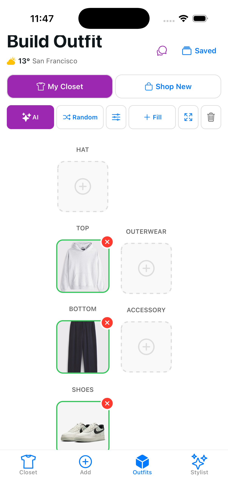

# Suburban Outfitter

A personal wardrobe management and AI styling app built with Expo and React Native. Catalog your clothing, build outfits, get AI-powered styling suggestions, and find new pieces that complement your wardrobe.

## Screenshots

<p align="center">
  
  
  
  
</p>

## Features

- **Digital Closet** — Photograph and catalog clothing items with category, tags, and image thumbnails
- **Outfit Builder** — Assemble outfits from your closet and save them for later
- **Random Outfit** — Get random outfit suggestions with weather-aware filtering
- **AI Auto-Tagging** — Analyze clothing photos with Claude's vision API to detect category, colors, style, formality, pattern, material, and more
- **Smart Outfit Generation** — AI builds complete outfits from your wardrobe based on occasion, weather, and your style profile
- **Inspiration Matching** — Upload a photo from Pinterest or Instagram and the AI matches it against items you already own
- **Natural Language Chat** — Describe what you want ("build me a date night outfit") and the AI assembles it
- **Shopping Suggestions** — When your closet falls short, get purchase recommendations with Amazon and Google Shopping links
- **Style Profile** — Set body type, skin tone, and style preferences so AI recommendations are personalized

## Getting Started

### Prerequisites

- Node.js 18+
- iOS Simulator (Xcode) or Android Emulator (Android Studio)

### Install

```bash
npm install
```

### Environment Variables

Copy the example env file and add your API keys:

```bash
cp .env.example .env.local
```

`.env.local` requires two keys:

| Variable | Description |
|---|---|
| `EXPO_PUBLIC_WEATHER_API_KEY` | [OpenWeatherMap](https://openweathermap.org/api) API key for weather-based outfit suggestions |
| `EXPO_PUBLIC_CLAUDE_API_KEY` | [Anthropic](https://console.anthropic.com/) API key for all AI features |

AI features work without a key — they just won't be available until one is configured (can also be set in-app under Settings > AI Setup).

### Run

```bash
npm start           # Start Expo dev server
npm run ios         # Run on iOS simulator
npm run android     # Run on Android emulator
```

## Tech Stack

| Layer | Technology |
|---|---|
| Framework | Expo SDK 54, React Native 0.81 |
| Routing | expo-router (file-based) |
| Database | expo-sqlite (synchronous API via `openDatabaseSync`) |
| AI | Claude API (vision + text) via direct fetch |
| Images | expo-image-picker + expo-image-manipulator |
| Location | expo-location (for weather lookups) |
| State | React hooks wrapping a SQLite storage service |
| Testing | Jest 29 + React Testing Library |

## Project Structure

```
app/
  (tabs)/
    closet/             # Closet browsing and search
    outfits/            # Outfit list, builder, AI generate, inspiration, chat
    settings/           # AI setup, profile, style quiz
    add.tsx             # Add new clothing item (with AI analyze)
    item/[id].tsx       # Item detail view
  _layout.tsx           # Root layout
  modal.tsx             # Shared modal

services/
  ai/
    ai-provider.ts      # Provider interface and types
    ai-service.ts       # Orchestrator singleton with caching
    claude-provider.ts  # Claude API implementation (vision + text)
    prompts.ts          # All prompt templates
  affiliate/
    affiliate-service.ts # Amazon/Google Shopping link generation
  storage.ts            # SQLite database, migrations, all CRUD
  image-service.ts      # Image picking, compression, base64 conversion
  weather.ts            # OpenWeatherMap integration
  randomizer.ts         # Random outfit selection logic

app/components/         # Reusable UI (outfit builder, AI tags, product cards, etc.)
app/hooks/              # use-items, use-outfits
app/types/              # TypeScript types (Item, Outfit, AI attributes, UserProfile)
app/constants/          # Theme colors and app constants

__tests__/              # 36 test files covering storage, AI, UI, and integration
```

## Data Models

**Item** — Clothing item with name, category, image path, tags, visibility state (`hiddenUntil` for temporary hiding), and optional AI attributes (colors, style, formality, pattern, material, seasons, weather suitability).

**Outfit** — Named collection of item IDs with optional style notes.

**UserProfile** — Body type, skin tone, height, style preferences, color preferences, lifestyle tags, and feedback counters.

Arrays (tags, itemIds, preferences) are stored as JSON strings in SQLite.

## Testing

```bash
npm test                              # Run all tests
npm test -- __tests__/storage.test.ts # Run a single test file
npm run lint                          # ESLint
```

## Environment & Secrets

- **`.env.example`** — Committed. Contains placeholder variable names only.
- **`.env.local`** — Gitignored. Your real API keys go here.
- Keys can also be entered at runtime via Settings > AI Setup (stored in SQLite).
- See `.gitignore` for the full list of ignored secret patterns (`.env.*`, `*.key`, `*.pem`, `*.keystore`, etc.).
